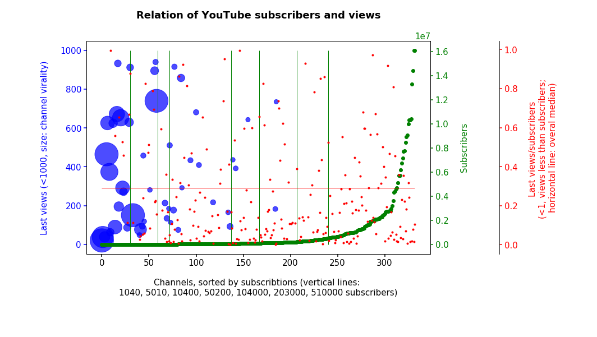
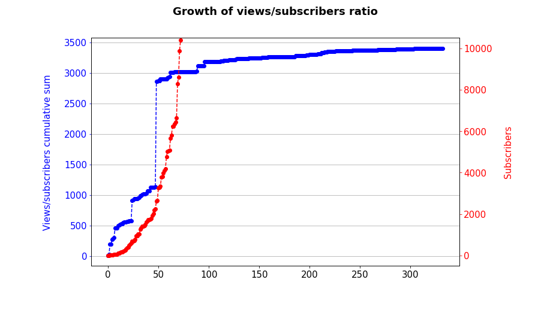

# YouTube subscribers/views relation


- Check if it's unusual to have <500 views per video for 150K channel
- Check if there is any visible relation between subscribers and views count

## Results

Plot shows 333 of 345 channels I am subscribed to (for some data isn't available), sorted by subscriptions and rated by:
- **last views** — views of fresh videos — average views of lats 4 videos (excluding very last one, <1000 shown),
- **virality** — (here) relation of average views per video and subscribers.   
Shows channels with relatively few videos and subscribers, but a lot of views — hence they made only a few viral videos:
```
virality = total_views/total_videos/subscribers
```
- **subscribers**, and
- **relation of views to subscribers** (<1 shown — views less than subscribers)




Views to subscribers ratio almost stops growing somewhere around 9000 subscribers:



### Conclusion
- **Only 1 channel of 333 with over 100K subscribers has less than 500 views of fresh videos**,  
- **In general 30% of subscribers watch new posts** (median relation is 0.3)  


## Background
I've came across one cooking video, I liked the story and production quality, so I subscribed.  
At the moment of writing that video had **18M views** and channel had about **140K followers** (seen on the plot: bottom one of rightmost two among blue ones — with last views less than 1000).  

Then I noticed — **videos have only a few hundred views**. I was surprised, because most channels I'm subscribed to has (as I feel it) proportional amount of subscribers and views — I thought that something is going on there.  
So I decided to **check if this channel stands out among my subscriptions**.


## How to reproduce
### You'll need
- Google YouTube API key
- List of YouTube channel IDs

### Setup and run
- Clone and install project: I use `pipenv`, so `$ pipenv install`
- Run Jupyter `$ jupyter notebook` and open notebook `yt_views.ipynb`
- Add API key and list of channels (read below)
- Run all cells. This will:
  - read your API key from file,
  - read channel IDs,
  - request data from YouTube API (spent ~2000 of 10'000 free quota points for my 346 channels [in docs](https://developers.google.com/youtube/v3/getting-started#quota), [in YouTube Data API console](https://console.developers.google.com/apis/api/youtube.googleapis.com/)),
  - prepare (filter) and save collected data to `data.json` file (so you don't need to refetch it later),
  - read data back from file,
  - draw a plot.

### Setup API and get credentials
YouTube Data API Overview: https://developers.google.com/youtube/v3/getting-started
- Enable YouTube Data API and create API key in console: https://console.developers.google.com/apis/dashboard
- Add API key to `.g_api_key` file

### Get list of channels  
If you already have have one — jump to the last ("save to the file") step  

- Open list of channels you're subscribed: https://www.youtube.com/feed/channels
- List gets updated on scroll, so scroll to the bottom of page until it stops loading
- Open console in browser, paste following script and hit Enter.
  This will replace page content with the array of channel IDs.   
  **ATTENTION**: *Use on your own discretion and only if you understand what this code does. No warranties in case of any damage! It will replace the content of your page and you will have to refresh it to restore. All unsaved data will be lost.*  
```
ids = []
all_links = document.querySelectorAll("#main-link");
all_links.forEach(function(l){
    ids.push(l.href.slice(-24,))
})
document.body.innerText = JSON.stringify(ids)
```
- Copy resulting array `[...]`, add to `channels.json` file (replace given array `[]`) and save:
```
{
    'channel_ids': [
        "UC6rmvCWRS5ANKl55X5RCRmA",
        ...
    ]
}
```

## License
You can use all of this as you wish and don't required to mention me (but I'll appreciate).  

## Disclaimer
Use and distribute it on you own risk. No warranty included for any case of any damage.
